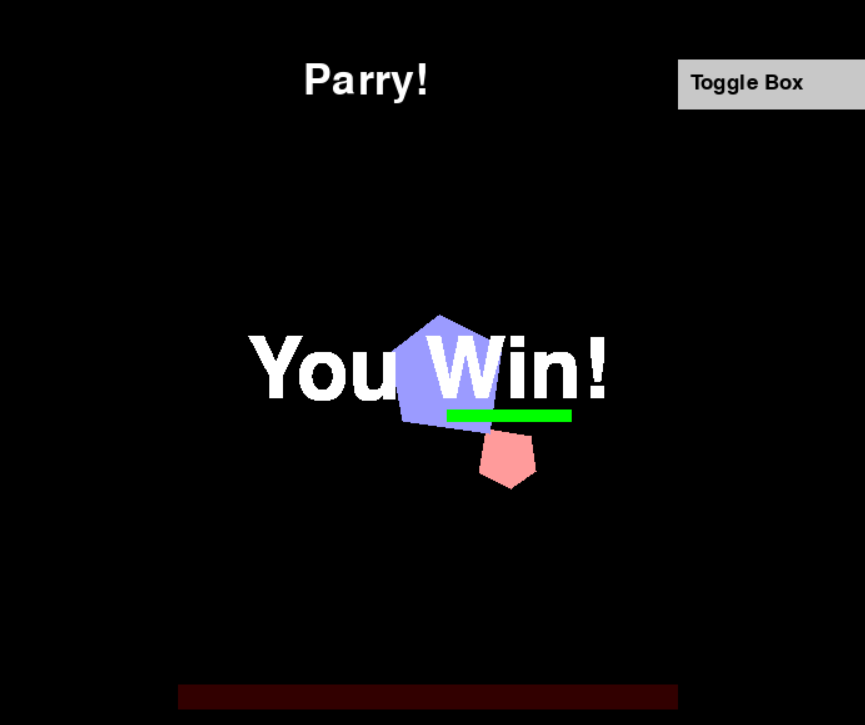

  
</br>

<H2 align="center"> Collision Detection Simulator </p>


</br>
</br> 

##  About

<h3 align="center"> SplitSecond  </h3>
<p align="center"><em>Created for :</em></p>
<p align="center"><em>"Application of Linear Algebra for Optimizing Collision Detection in Precision Parry-Based Combat Systems for Sekiro-like Games"</em></p>

<div align="center">
  
</div>
</br>
</br>
SplitSecond is a simple simulation game to demonstrate the inner workings of collision detection, written as a supplementary resource for a Linear and Geometric Algebra paper (see doc).

The game lets you take control of a shape, where  the goal is to defeat the boss by parrying its attacks, chipping away its health until it reaches zero.

<h3><b>Programs</b></h3>

- **Main Game**: Experience the parry-based combat system to test out the collision detection.
- **AABB**: See how Axis-Aligned Bounding Box work with this illustration
- **SAT**: Explore how precision collision detection works in Separating Axis Theorem.

<h3><b>Controls</b></h3>

- **WASD**: Move Red Pentagon
- **Arrow Keys**: Move Blue Pentagon
- **Q / E**: Rotate Red Pentagon
- **Right Ctrl / Right Shift**: Rotate Blue Pentagon

##  Getting Started
<h3>Installation</h3>
1 . Clone the repo

```
git clone git@github.com:grwna/Algeo02-23035.git
git clone https://github.com/grwna/Algeo02-23035.git
```

2 . Install Python dependencies
```
pip install -r requirements.txt
```

3 . Run Programs
```
python -m src.SplitSecond
python -m src.aabb
python -m src.sat
```


<h3><b>Program Structure</b></h3>

```
Root
├── doc
│   └── Paper.pdf
├── images
├── src
│   ├── aabb.py
│   ├── game_logic.py
│   └── main_game.py
├── sat.py
└── SplitSecond.py
```
 
